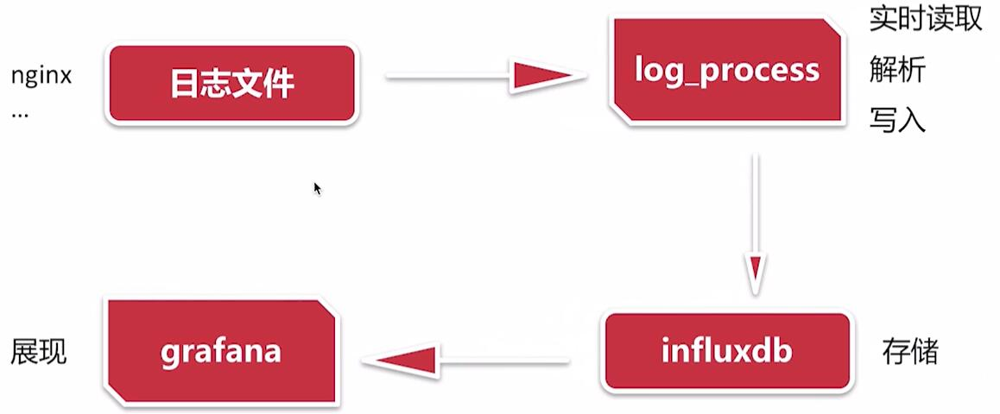
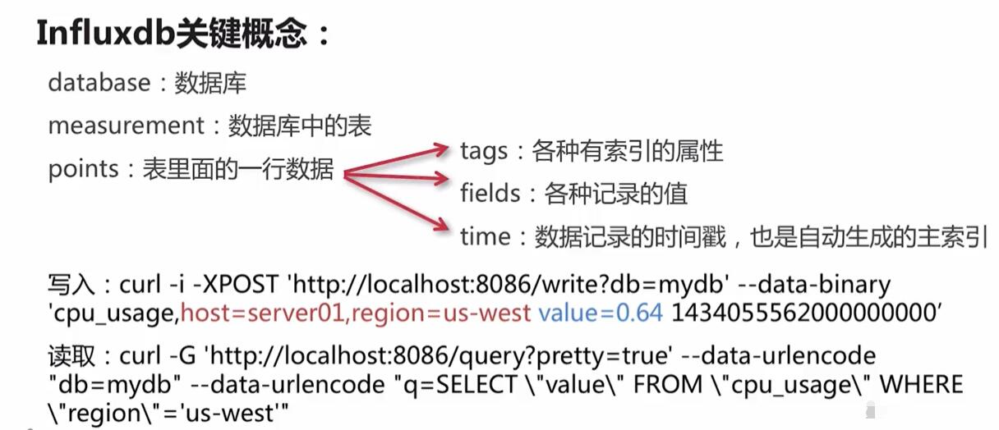

# Golang并发编程案例解析
## 一、项目介绍：
### 1.项目内容
- 并发编程基础知识介绍；
- 日志监控系统实战；
- 课程总结；
## 2. 日志监控系统：

ps:
- influxdb: 开源的时序数据库

## 3.常见并发模型:
- 进程&线程:
    - C10k: 服务器要支持10k的并发;
-  异步非阻塞:
    - 常见方案: Nginx, Libevent, NodeJS
    - 复杂度比较高
- 协程:
    - 常见方案: Golang, Erlang, Lua

## 4. Golang并发实现:
- 程序并发执行(goroution);
```go
foo() // 执行foo函数, 程序等待函数foo返回

go foo()    // 创建协程执行foo函数
bar()   // 不用等待foo返回
```
- 多个goroution间的数据同步和通信(channels);
```go
c := make(chan string)  // 创建一个channel

go func() {
    time.Sleep(1 * time.Second)
    c <- "message from closure" // 发送数据到channel中
}()
msg := <-c  // 阻塞直到接收到数据
```
- 多个channel选择数据读取或者写入(select)
```go
select {
case v := <-c1:
    fmt.Println("channel 1 sends", v)
case v := <-c2:
    fmt.Println("channel 2 sends", v)
default: // 可选, 一般不用
    fmt.Println("neither channel was ready")
}
```

### 5. 并发与并行:
#### 5.1 定义:
- 并发:
    - 看起来像
- 并行:
    - 实际上的
#### 5.2 小结:
- 将复杂的任务拆分, 通过goroutione去并发执行;
- 通过channel做数据通信;

### 6. Golang中的面向对象:
#### 6.1 golang中的"对象类型":
- struct;
- interface;

#### 6.2 封装:
```go
type Foo struct {
    baz string
}

func (f *Foo) echo() {
    fmt.Println(f.baz)
}

func main() {
    f := Foo{baz: "hello world"}
    f.echo()
}
```

#### 6.3 继承:
```go
type Foo struct {
    baz string
}

type Bar struct {
    Foo
}

func (f *Foo) echo {
    fmt.Println(f.baz)
}

func main() {
    b := Bar{Foo{baz: "hello, struct"}}
    b.echo()
}
```
#### 6.4 多态:
```go
type Foo interface {
    qux()
}

type Bar struct {}
type Baz struct {}

func (b Bar) qux() {}
func (b Baz) qux() {}

func main() {
    var f foo
    f = Bar{}
    f = Baz{}
    fmt.Println(f)
}

```

## 二、日志监控系统
### 1.系统结构设计:
log_process.go
```go
package main

import (
	"fmt"
	"strings"
)

// 定义接口
type Reader interface {
	Read(rc chan<- string)
}
type Writer interface {
	Write(wc <-chan string)
}

type LogProcess struct {
	rc    chan string
	wc    chan string
	read  Reader
	write Writer
}

type ReadFromFile struct {
	path string // 日志文件的路径
}

func (r *ReadFromFile) Read(rc chan<- string) {
	line := "message"
	rc <- line
}

type WriteToInfluxDB struct {
	influxDBDsn string // influxdb data source
}

func (w *WriteToInfluxDB) Write(wc <-chan string) {
	dd := <-wc
	fmt.Println(dd)
}

// 解析模块
func (l *LogProcess) Process() {
	data := <-l.rc
	l.wc <- strings.ToUpper(data)
}

func main() {
	r := &ReadFromFile{
		path: "/tmp/access.log",
	}
	w := &WriteToInfluxDB{
		influxDBDsn: "username&password",
	}
	lp := &LogProcess{
		rc:    make(chan string),
		wc:    make(chan string),
		read:  r,
		write: w,
	}
	go lp.read.Read(lp.rc)
	go lp.Process()
	go lp.write.Write(lp.wc)

	// 此处主协程需要阻塞
	for {

	}
}
```

### 2. 读取模块的实现:
- 打开文件;
- 从文件末尾开始逐行读取;
- 写入到ReadChan

### 3. 解析模块:
- 从Read Channel中读取每行日志的数据;
- 使用正则提取监控数据(path, status, methods);
- 写入Write Channel;

### 4. 写入模块的实现:
- 初始化influxdb client;
- 从write Channel中读取数据;
- 构造数据并写入influxdb;

##### influxdb:
influxdb是一个开源分布式时序、时间和指标数据库，使用 Go 语言编写，无需外部依赖。
应用：性能监控，应用程序指标，物联网传感器数据和实时分析等的后端存储。
- docker 安装:
```shell
docker pull influxdb
docker run -d -p 8086:8086 -v influxd1:/var/lib/influxd -v influxd2:/var/lib/influxd2 -e DOCKER_INFLUXDB_INIT_MODE=upgrade -e DOCKER_INFLUXDB_INIT_USERNAME=admin -e DOCKER_INFLUXDB_INIT_PASSWORD=admin123 -e DOCKER_INFLUXDB_INIT_ORG=my-org -e DOCKER_INFLUXDB_INIT_BUCKET=my-bucket influxdb
```
ps: 
- `DOCKER_INFLUXDB_INIT_USERNAME`: 为系统初始超级用户设置的用户名(必需);
- `DOCKER_INFLUXDB_INIT_PASSWORD`: 为系统初始超级用户设置的密码(必需);
- `DOCKER_INFLUXDB_INIT_ORG`: 为系统的初始组织设置的名称(必需);
- `DOCKER_INFLUXDB_INIT_BUCKET`: 为系统的初始存储桶设置的名称(必需);



### 5. 日志监控系统：
#### 5.1 分析监控需求：
某个协议下的某个请求在某个请求方法的QPS&响应时间&流量
Tag: path, methods, Scheme, status
Fields: upstream, requestTime, bytesSent
Time: TimeLocal
##### 5.2 实现:
influxdb: [influxdb](https://github.com/influxdata/influxdb)
influxdb客户端:[influxdb客户端](https://github.com/influxdata/influxdb-client-go)


##### 5.3 绘制监控图:
- 用grafana;

#### 6.监控模块的实现:
- 总处理日志行数;
- 系统吞吐量;
- read channel长度;
- write channel长度;
- 运行总时间;
- 错误数;
